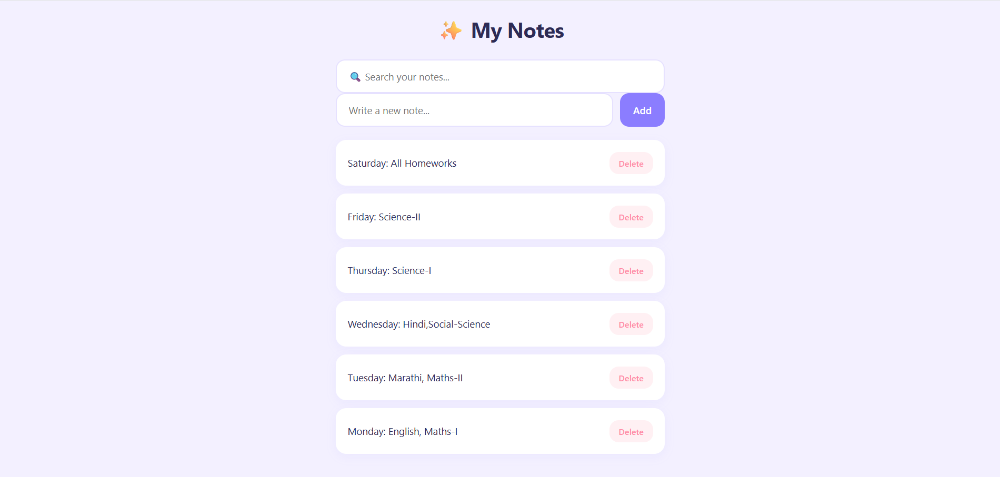

# Smart-Notes-Manager

A simple and user-friendly Notes Management App that helps users create, search, delete, and save notes directly in the browser using Local Storage.

## ✨ Features

- Add new notes
- Delete notes
- Search notes instantly
- Save notes using Local Storage
- Persistent data after page refresh
- Clean and responsive UI

## 🛠️ Technologies Used

- HTML5
- CSS3
- JavaScript

## 📸 Screenshot

## 📚 What I Learned

- DOM Manipulation
- Local Storage API
- Form Handling
- Search Functionality
- Event Handling
- Dynamic Content Rendering

## 🎯 Purpose of Project

This project was created to practice JavaScript fundamentals by building a useful notes application with data persistence and search functionality.

## 🚀 Future Improvements

- Edit Notes
- Categories and Tags
- Dark Mode
- Export Notes
- Note Priorities

## 👩‍💻 Author

Nikita
